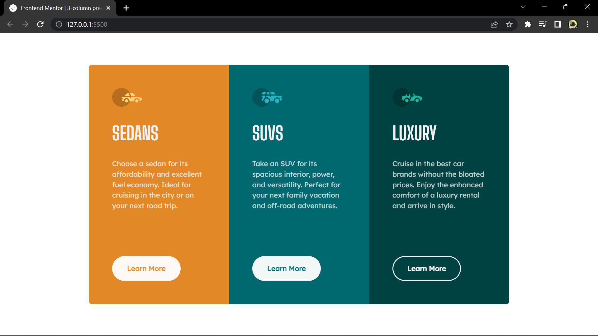

# Frontend Mentor - 3-column preview card component solution

This is a solution to the [3-column preview card component challenge on Frontend Mentor](https://www.frontendmentor.io/challenges/3column-preview-card-component-pH92eAR2-). Frontend Mentor challenges help you improve your coding skills by building realistic projects. 

## Table of contents

- [Overview](#overview)
  - [The challenge](#the-challenge)
  - [Screenshot](#screenshot)
  - [Links](#links)
- [My process](#my-process)
  - [Built with](#built-with)
  - [What I learned](#what-i-learned)
  - [Continued development](#continued-development)
- [Author](#author)

## Overview

### The challenge

Users should be able to:

- View the optimal layout depending on their device's screen size
- See hover states for interactive elements

### Screenshot

### Links

- Solution URL: [Frontend Mentor](https://www.frontendmentor.io/solutions/3column-preview-card-component-TETaWM3jfO)
- Live Site URL: [Live site](https://69kwan69.github.io/3column-preview-card-component/)

## My process

### Built with

- Semantic HTML5 markup
- CSS custom properties
- Flexbox
- CSS Grid
- Mobile-first workflow

### What I learned

I thought grid should be used in this project so I learned it. Alas, only 2 lines of code were grid-related. At least this time I try to take the Mobile-first approach.

### Continued development

Mobile-first approach seems new and weird to me, but I'll stick with it next few projects.

## Author

- Frontend Mentor - [@69kwan69](https://www.frontendmentor.io/profile/69kwan69)
